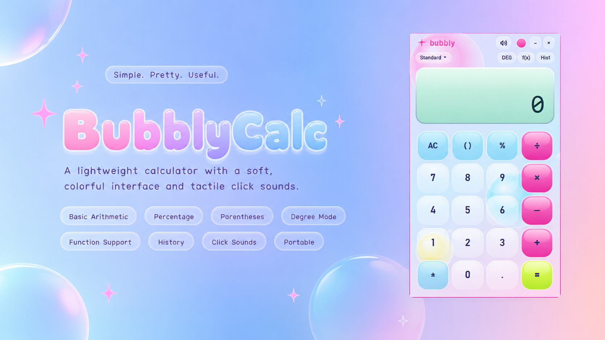

# BubblyCalc

A small, lightweight desktop calculator made for myself.

BubblyCalc focuses on a soft, colorful interface, subtle animations, and tactile click sounds to make something as simple as using a calculator feel a little more enjoyable.

## Features
- idk basic calculator stuff
- click sounds
- portable

## Windows

The current version is available for Windows as a standalone executable.

Download the latest release, open the `.exe`, and use it directly.

## Download

The latest Windows build can be found on the
[Releases](../../releases) page.

## Linux

A Linux version is planned for a future release.

## About

I originally made BubblyCalc as a small personal project because I wanted a calculator that felt a little more fun and pleasant to use than the usual built-in calculator apps.

It is intentionally simple and lightweight, with the interface and little details such as the button sounds being just as important as the calculations themselves.

## License

See the [LICENSE](LICENSE) file for details.
